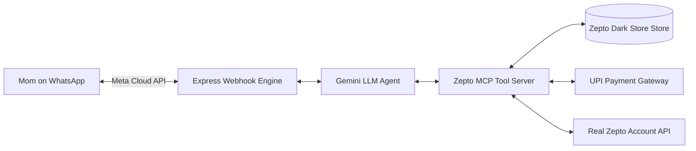

# 🛒 Zepto WhatsApp Agent for Mom (Amma Sahayaka)

An autonomous, multi-turn AI grocery ordering assistant designed specifically for Indian households to order groceries via WhatsApp in **Kannada, Kanglish, and English**. Powered by the **Model Context Protocol (MCP)**, **Google Gemini AI**, **Meta WhatsApp Business Cloud API**, and **Zepto Dark Store APIs**.

---

## 🌟 Key Features

- 🗣️ **Trilingual Natural Language Understanding**: Speaks and understands native Kannada script, Kanglish (Kannada in English alphabet), and English.
- ⚡ **Model Context Protocol (MCP) Server**: Official `@modelcontextprotocol/sdk` implementation exposing tools for search, cart management, coupons, order placement, tracking, and cancellation.
- 📱 **Official Meta WhatsApp Cloud API**: Built-in interactive quick reply buttons (`[⚡ Pay with UPI]`, `[💵 Cash on Delivery]`, `[❌ Clear Cart]`), order receipts, and read receipts.
- 🛵 **Direct Zepto Account Integration**: Connected to live user sessions for automated doorstep Cash on Delivery (COD) order dispatch.
- 💳 **Instant NPCI UPI Deep Links**: Generates 1-tap payment intent links that directly open GPay, PhonePe, Paytm, or BHIM on mobile.
- ☁️ **24/7 Cloud Architecture**: Dockerized production deployment on Render with 100% uptime without requiring local machines.

---

## 🛠️ MCP Tools Exposed

| Tool Name | Description |
| :--- | :--- |
| `search_zepto_products` | Search Bengaluru dark store inventory across Dairy, Veggies, Atta, Beverages, Snacks |
| `get_product_details` | Retrieve product unit price, MRP, stock count, and Kannada aliases |
| `add_to_cart` | Add specified quantities of grocery items to the active user cart |
| `get_cart` | Retrieve the itemized breakdown, discounts, delivery fee, and grand total |
| `update_cart_quantity` | Update quantities or adjust items in the active cart |
| `remove_from_cart` | Remove individual items from the shopping cart |
| `apply_coupon` | Apply promo discount codes (e.g. `ZEPTO50`, `AMMA50`, `FREESHIP`) |
| `place_order` | Finalize checkout, dispatch rider, generate UPI payment links or COD |
| `track_order` | Check real-time packing status, assigned rider details, and 10-minute ETA |
| `cancel_order` | Cancel active orders and initiate automatic UPI refunds |

---

## 🏛️ System Architecture



---

## 🚀 Environment Configuration (`.env`)

```env
# Google Gemini AI Configuration
GEMINI_API_KEY=your_gemini_key
GEMINI_MODEL=gemini-flash-lite-latest

# Meta WhatsApp Business Cloud API Configuration
WHATSAPP_TOKEN=your_permanent_system_user_token
WHATSAPP_PHONE_NUMBER_ID=1270505186142513
WHATSAPP_BUSINESS_ACCOUNT_ID=1052419027712362
WHATSAPP_VERIFY_TOKEN=zepto_mom_agent_secret_2026
WHATSAPP_API_VERSION=v21.0

# Delivery Profile
DEFAULT_DELIVERY_ADDRESS="House 207, Ihita South Avenue, Simhadri Layout, Uttarahalli Main Road, Bangalore - 560061"
DEFAULT_USER_NAME="Amma"
UPI_PAYMENT_VPA="zepto.orders@icici"
UPI_PAYEE_NAME="Zepto Grocery"

# Real Zepto Live Account Session
ZEPTO_AUTH_TOKEN="your_zepto_jwt_token"
ZEPTO_USER_ID="your_zepto_user_id"
ZEPTO_SESSION_ID="your_zepto_session_id"
ZEPTO_PHONE_NUMBER="7259140866"
ZEPTO_LATITUDE="12.9073717"
ZEPTO_LONGITUDE="77.5457656"
```

---

## 🧪 Local Development & Testing

```bash
# Install dependencies
npm install

# Run local development server
npm run dev

# Run MCP stdio CLI server (for Claude Desktop / Antigravity)
npm run mcp

# Run test suites
npm run test:mcp     # MCP tool validation
npm run test:agent   # Multi-turn Kanglish agent conversation
npm run test:cloud   # Meta webhook simulation
```

---

## 📦 Deployment

This service includes a production-ready `Dockerfile` and is designed for 1-click deployment on **Render**, **Railway**, or **Google Cloud Run**.

```bash
docker build -t zepto-agent .
docker run -p 3000:3000 --env-file .env zepto-agent
```
